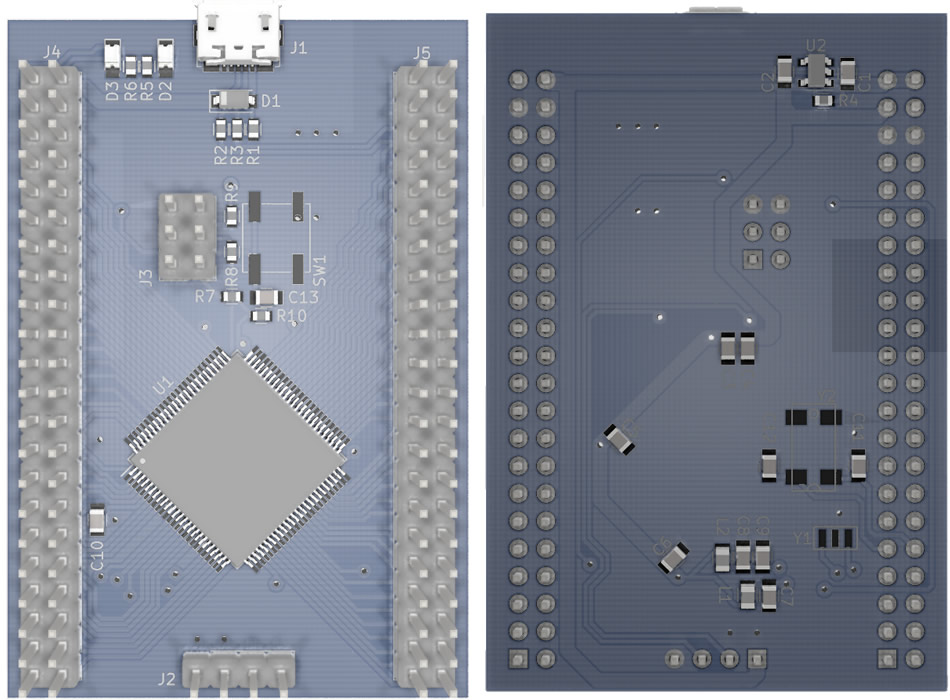
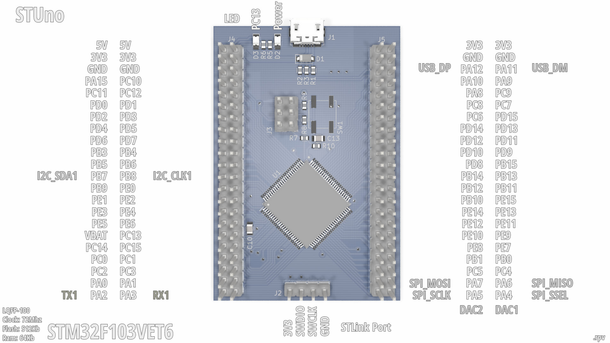
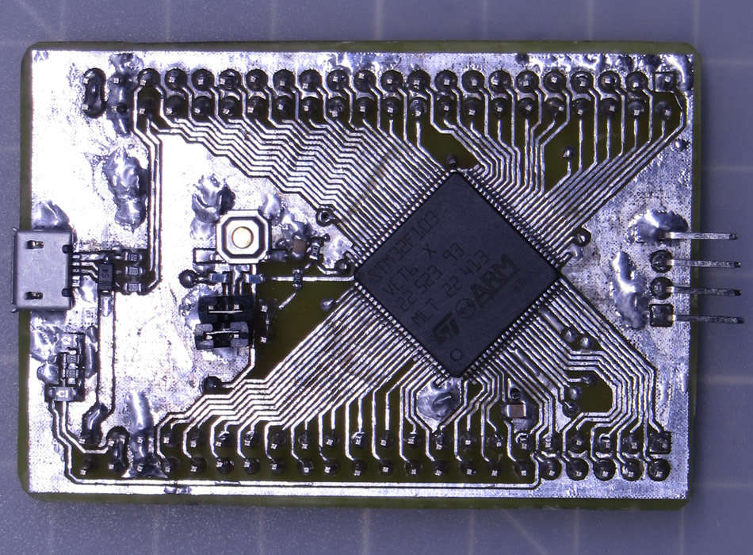
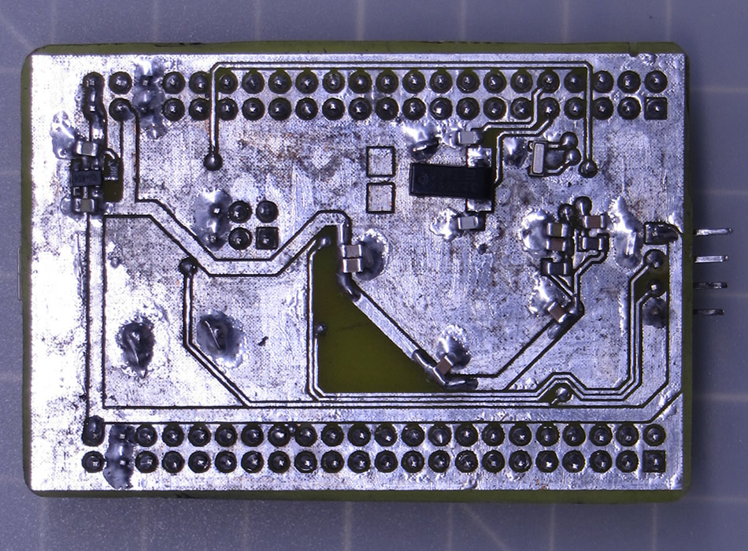
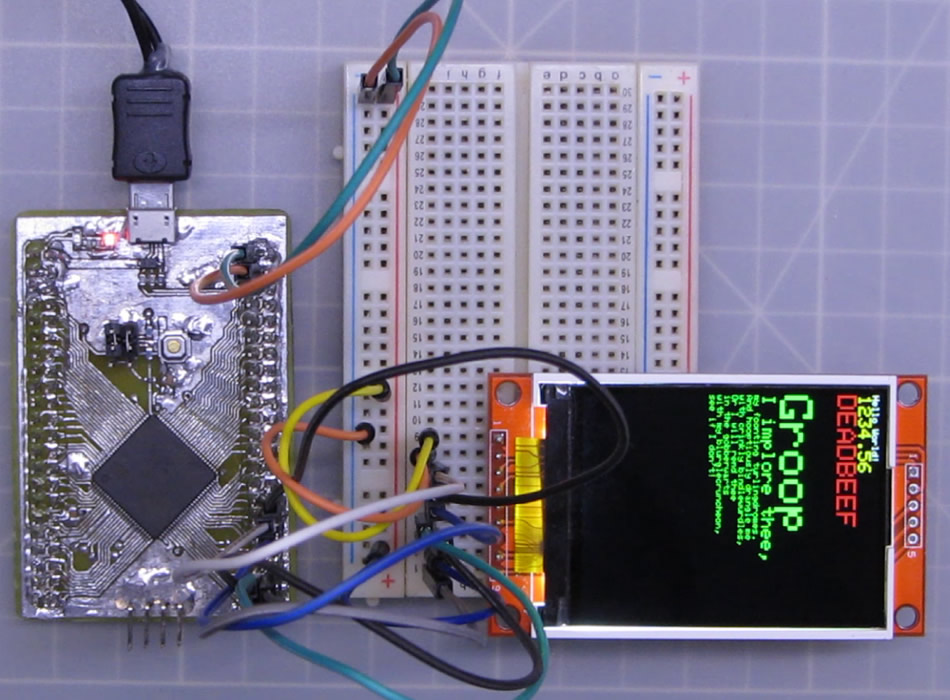

# STM32F103VET6 STUno

An ST development board based on the STM32F103VET6/STM32F103VE (Clock: 72MHz, Flash: 512Kb, Ram:64Kb) MCU (the LQFP-100 version of the famous Blue Pill) compatible with STM32Duino (Arduino).



Pinout:




## Files and Folders description

- **RBOARD_F103VET6** it's the variant board for the STM32 Arduino Core.
- **rSTM32F103VET6** it's the KiCAD 5.1.2 project.
- **rSTM32F103VET6.schematic.pdf** the schematic.


## Install

**Update:** Since STCore version **1.9.0** most of the F103XXX boards (including this) are already supported, so there is no need to install anything.


- This requires the [STM32 core for arduino](https://github.com/stm32duino/Arduino_Core_STM32/), the ST original.
- I used this [guide to add the board](https://github.com/stm32duino/wiki/wiki/Add-a-new-variant-(board)), you can check it or continue with my suggestions to install the new board.
- Copy the **"RBOARD_F103VET6"** folder to the Arduino **"variants"** folder, in win7 is located at: **c:\Users\\<USERNAME\>\AppData\Local\Arduino15\packages\STM32\hardware\stm32\1.8.0\variants**
- Edit the **"boards.txt"** file, in win7 is located at a lever up than the "variants" folder, search for the **Generic F1** board line and add the lines to leave it as I show you next:

```
GenF1.menu.pnum.Generic_F103RET6=Generic F103RET6 (Blue Button)
GenF1.menu.pnum.Generic_F103RET6.upload.maximum_size=524288
GenF1.menu.pnum.Generic_F103RET6.upload.maximum_data_size=65536
GenF1.menu.pnum.Generic_F103RET6.build.board=GENERIC_F103RET6
GenF1.menu.pnum.Generic_F103RET6.build.product_line=STM32F103xE
GenF1.menu.pnum.Generic_F103RET6.build.variant=Generic_F103Rx


# Generic STM32F103VET6 STUno
GenF1.menu.pnum.RBOARD_F103VET6=STM32F103VET6 STUno
GenF1.menu.pnum.RBOARD_F103VET6.upload.maximum_size=524288
GenF1.menu.pnum.RBOARD_F103VET6.upload.maximum_data_size=65536
GenF1.menu.pnum.RBOARD_F103VET6.build.board=RBOARD_F103VET6
GenF1.menu.pnum.RBOARD_F103VET6.build.product_line=STM32F103xE
GenF1.menu.pnum.RBOARD_F103VET6.build.variant=RBOARD_F103VET6
```
(add after the _"# Generic STM32F103Rx boards (Blue button)"_ section).

That's all.

So on the arduino IDE, on the **boards** menu pick the option _"Generic STM32F1 series"_ and the **board part number:** suboption pick the _"STM32F103VET6 STUno"_ option.


## Installation Bug

So there was a bug on older versions of the core <1.7 so you should use at least the 1.7 Core version, at the moment to write this update to the documentation the ST Core last version relase it's 1.8 so it's highly recomended that you should use this version (or newer if available).


## The real board

**Front**



**Back**



_*The footprint for the second crystal (Y2) was wrong on this board but it's already corrected on the KiCAD files._


## Running some tests




The **STUno** running the Adafruit ILI9341 library over hardware SPI.


_Video in progress..._
