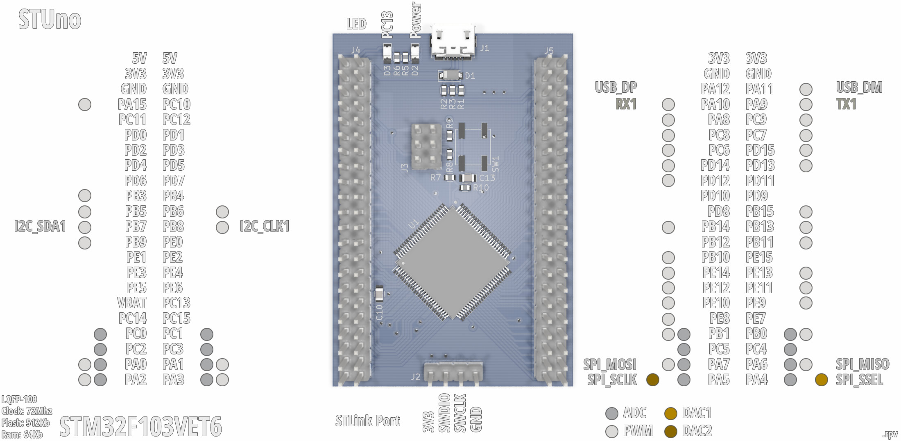

# STM32F103VET6 STUno

An ST development board based on the STM32F103VET6/STM32F103VE (Clock: 72MHz, Flash: 512Kb, Ram:64Kb) MCU (the LQFP-100 version of the famous Blue Pill) compatible with STM32Duino (Arduino).

Pinout:

## Files and Folders description

- **RBOARD_F103VET6** it's the variant board for the STM32 Arduino Core.
- **rSTM32F103VET6** it's the KiCAD 5.1.2 project.
- **rSTM32F103VET6.schematic.pdf** the schematic.

## The real board

**Front**

**Back**

_*The footprint for the second crystal (Y2) was wrong on this board but it's already corrected on the KiCAD files._

## Running some tests

_Working on..._
